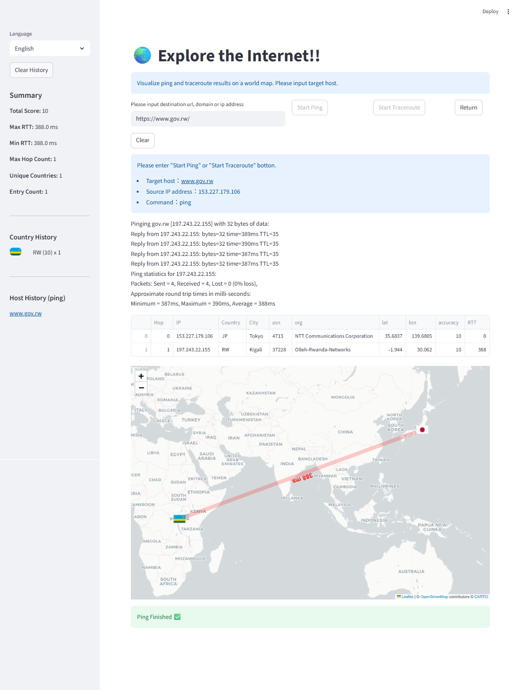
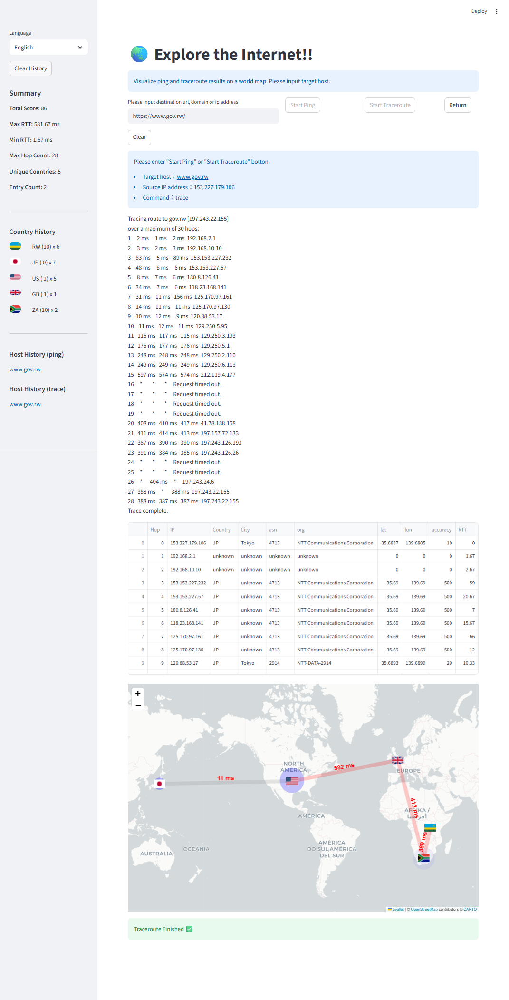

# Ping Quest


Ping Quest is an educational tool that visualizes **ping** and **traceroute** results on a world map.

It allows students to explore how Internet packets travel across the world by combining:

- traceroute results
- GeoIP location data
- ASN (Autonomous System Number) information
- RTT (network latency) measurements

The tool was originally developed as a **hands-on workshop for high school students and introductory university networking courses**.

Download and watch the demo video:
[Ping Quest Demo Video](docs/PingQuestDemo.mp4)

# Overview
## インターネットを探検しよう
私たちは毎日インターネットを利用していますが、その通信が **世界のどこを通っているのか** を意識することは
ほとんどありません。

Ping Quest は、Ping や Traceroute を使って**インターネットの通信経路を世界地図上に可視化する教育ツール**です。

このツールを使うことで、次のようなことを体験できます。

* いつも使っている Web サイトはどこにあるのか
* 日本から海外のサイトへはどの国を経由するのか
* 通信はどこで海を越えるのか
* なぜ遠くのサーバほど通信が遅くなるのか
* なぜ有名なサイトは近くにあるのか(CDNの価値)

実際に調査しながら、**インターネットが世界中のネットワークとつながっていることを体験的に学びます。**

Ping Quest は、高校生向けのネットワーク体験授業や大学の初学者向けのネットワーク演習での利用を想定して開発されています。

When we access a website, packets travel through many routers across the Internet.
Ping Quest allows students to **observe and visualize that journey**.

Using this tool, students can:
* discover where a website is located
* observe how many routers are involved
* see how network latency increases with distance
* explore international network paths
* understand the uncertainty of GeoIP location estimation

The result is displayed on an interactive world map.

## Educational Purpose

Ping Quest is designed for:
* high school outreach workshops
* introductory university networking classes
* cybersecurity education
* Internet measurement demonstrations

The tool encourages **exploration and inquiry-based learning**.

Students investigate questions such as:
* Where is a website physically located?
* How many routers are involved in reaching a server?
* At which hop does the traffic cross the ocean?
* Why are some hops slower than others?
* Why are GeoIP locations sometimes inaccurate?


# Screenshot

## Example: Ping Result

Ping result showing the estimated location of the destination server.




---

## Example: Traceroute Visualization

Traceroute example showing multiple hops and international routing paths.



The visualization includes:

- hop-by-hop network path
- IP address and country
- RTT (latency)
- ASN and organization
- GeoIP accuracy radius


# Features
* Execute `ping` and `traceroute`
* Visualize network routes on an interactive world map
* Display hop-by-hop RTT
* Show ASN and organization information
* Display GeoIP accuracy radius
* Highlight uncertainty of network path estimation
* Designed for educational workshops
* Show geo location accuracy based on Maxmind database

## Sidebar

Ping Quest includes a **sidebar dashboard** that summarizes exploration results.
Results accumulate until the **Clear History** button is pressed.

### Summary Information

The following statistics are automatically calculated:

- **Total Score**  
  Total exploration score based on visited countries.

- **Max RTT**  
  Maximum round-trip time observed in all executions.

- **Min RTT**  
  Minimum round-trip time observed.

- **Max Hop Count**  
  Maximum number of hops observed in traceroute results.

- **Unique Countries**  
  Number of unique countries observed across all routes.

- **Entry Count**  
  Number of executed explorations stored in history.

### Country History

The sidebar also shows statistics per country:

- Country flag
- Country code
- Score value
- Number of appearances in the route

### Scoring System

Scores are based on global Internet traffic statistics from **Cloudflare Radar**.

https://radar.cloudflare.com/traffic

Countries with higher traffic receive lower scores, encouraging exploration of less common network regions.

| Ranking | Score |
|-------|------|
| Top 10 countries | 1 point |
| Top 20 countries | 5 points |
| Other countries | 10 points |
| Source country | 0 point |

Example:

🇯🇵 (5) x 3  
🇺🇸 (5) x 2  
🇬🇧 (5) x 1  
🇿🇦 (10) x 1

This allows users to easily see how their network routes traverse the world.

### Host History

The sidebar records explored hosts grouped by command:

- **ping**
- **trace**

If the same host is executed again with the same command, the result is not duplicated

### Clear History

Pressing **Clear History** will reset:

- All scores
- Country statistics
- Host history

# System Requirements
Python 3.9 or later

Required Python packages:
* streamlit
* folium
* pandas
* geoip2
* requests

Install dependencies:

```
pip install -r requirements.txt
```

---

## GeoIP Database
Ping Quest uses the **MaxMind GeoLite2 database**.
Download the free database from:
https://dev.maxmind.com/geoip/geolite2-free-geolocation-data/
After downloading, place the files in the `data/` directory:

```
data/
 ├ GeoLite2-City.mmdb
 └ GeoLite2-ASN.mmdb
```

These files are **not included in the repository**.


## Running the Application

Start the Streamlit application:

```
streamlit run app/pingquest.py
```

### With GeoIP database path
```
streamlit run app/pingquest.py -- --geoip-dir ./data
```

### With custom map center

```
streamlit run app/pingquest.py -- --map-home-lat 35.68 --map-home-lon 139.76
```

### Debug mode
```
streamlit run app/pingquest.py -- --debug
```

Then open the browser:

```
http://localhost:8501
```

# Internet Exploration Missions

Students analyze the results and discuss why the network path behaves that way.

### Mission 1: Web hosting / data center

* Find where your school's website is located on the world map.
* Is it located in the same place as your school, or somewhere else?
* What kinds of Internet services are provided by data centers?

### Mission 2: CDN

* Find where your favorite website (such as `google.com`) is located on the world map.
* Why are many popular websites located close to your location?
* Why do many websites use services such as Akamai or Cloudflare?
* What kind of services do Akamai or Cloudflare provides?

### Mission 3: ASN/ISP structure

* How many hops are required to reach YouTube?
* How many different network providers are involved in reaching YouTube?
* What does the ASN number means, and what does the networks providers name indicate?
* Why do packets pass through multiple network providers?

### Mission 4: Submarine Cable

* At which hop does the traffic cross the ocean?
* How do Internet packets travel across the ocean?
* Do they use satellite, submarine fiber-optic cables, or other methods?

### Mission 5: Latency

* Which hop has the highest latency?
* Why does the latency suddenly increase at that hop?
* Could you play an online game with this latency?

### Mission 6: Location Uncertainty 

* Find a hop where the GeoIP location seems inaccurate.
* Find a hop where the traffic crosses an ocean but the RTT is still low.
* Why can latency be lower or higher than expected?

### Mission 7: Global Internet structure

* How many countries can you travel through using Ping Quest?
* Find websites that use different country-code top-level domains (ccTLDs).
* Try to reach a country with a low Internet adoption rate.

### Mission 8: Gamification

* Who can get the highest total score within ten minutes?
* Who can find a website with the highest RTT?
* Who can find a website with the logest traceroute path?

### Mission 9: US Internet backbone

* Can you find a route that does not pass through the United States?
* Why does so much Internet traffic concentrate in the United States?

### Mission 10: Security

* Why are some hops hidden or missing in traceroute results?
* What might happen if attackers sent many requests to every router along the path?


# Known Limitations

Traceroute and GeoIP results are **estimations** and may not represent the exact physical network path.

Possible reasons include:

* ICMP rate limiting
* asymmetric routing
* MPLS tunnels
* Anycast routing
* GeoIP database inaccuracies

Understanding these limitations is part of the educational objective.


# Directory Structure

Example project structure:

```
ping-quest
│
├ README.md
├ requirements.txt
│
├ app
│   └ pingquest.py
│
├ docs/images
│   └ ping_example.png
│   └ tracert_example.png
│
└ data
    └ GeoLite2 databases (not included)
```

# Intended Audience

Ping Quest is suitable for:

* high school students interested in the Internet
* introductory networking courses
* cybersecurity education programs
* outreach activities and workshops

# License

MIT License

# Author 
Atsushi Kobayashi
Shonan Institute of Technology